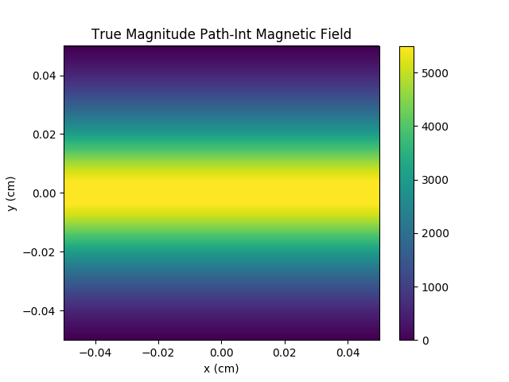

# PROBLEM Solver (PROton-imaged B-field nonLinear Extraction Module)

A proton radiography reconstruction tool in Python.

This provides a library of functions to reconstruct the path integrated magnetic
field present in a plasma based on a proton radiography flux image.

## Disclaimer

This package is in its beta stages of development. The only two tested example
problems are those included in the `examples/` directory. All other
reconstruction problems are made at the user's risk until further development
is made on `problem`.

## Installation

Requirements:

* [`numpy`](http://www.numpy.org/)
* [`scipy`](https://www.scipy.org/)

```bash
pip install numpy scipy
git clone https://github.com/flash-center/PROBLEM.git
cd problem
python setup.py install
```

## Usage

In order to reconstruct a magnetic field from a flux image, the following data
are needed:

* the relevant distances for the problem, i.e. the distance from the proton
    source to the plasma, the distance across the plasma, and the distance from
    the plasma to the detector
* the detector pixel size
* the flux image
* the velocity of the protons

In the following examples, the flux image and all other relevant data are
provided.

## Example Problems

### Donut

The donut is an ellipsoidal blob of magnetic field,


To run this example problem,
```bash
cd ~/PROBLEM/examples/donut/
python reconstruct.py
```

Checkpoint files for every 1000 steps will be saved in the `solve/` directory.

To plot the magnetic field at each time step, we need the
[`matplotlib`](https://matplotlib.org/) package. We install it by
```bash
pip install matplotlib
```
Now, we run our script to plot the magnetic field strength at each step,
```bash
python plot_images.py
```
This script will save the image of the magnetic field at each time step to the
`images/` directory for viewing.

### Strip

The strip is an vertical strip of magnetic field, designed to test the
boundaries of the PROBLEM solver,



To run this example problem,
```bash
cd ~/PROBLEM/examples/strip/
python reconstruct.py
```

Checkpoint files for every 1000 steps will be saved in the `solve/` directory.

To plot the magnetic field at each time step, we need the
[`matplotlib`](https://matplotlib.org/) package. We install it by
```bash
pip install matplotlib
```
Now, we run our script to plot the magnetic field strength at each step,
```bash
python plot_images.py
```
This script will save the image of the magnetic field at each time step to the
`images/` directory for viewing.

